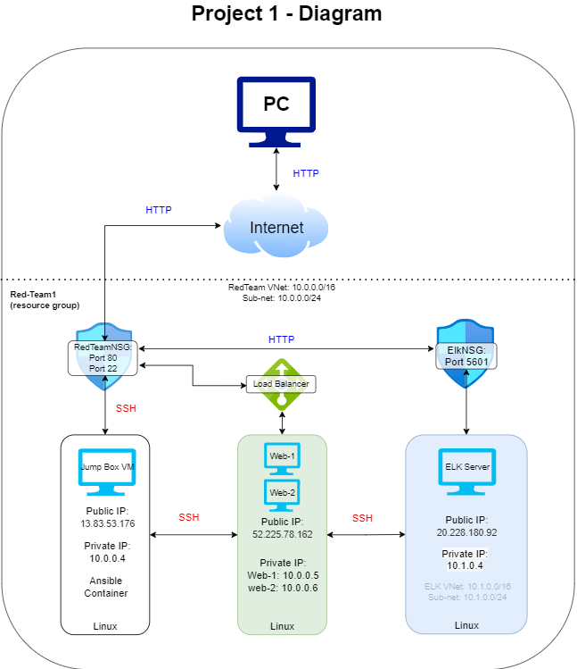

# CyberProject1
Project for ELK stack development

## Automated ELK Stack Deployment

The files in this repository were used to configure the network depicted below.

These files have been tested and used to generate a live ELK deployment on Azure. They can be used to either recreate the entire deployment pictured above. Alternatively, select portions of the `install-elk.yml` file may be used to install only certain pieces of it, such as Filebeat.

  - [Install ELK Playbook](Ansible/install-elk.yml)

This document contains the following details:
- Description of the Topology
- Access Policies
- ELK Configuration
  - Beats in Use
  - Machines Being Monitored
- How to Use the Ansible Build

### Description of the Topology

The main purpose of this network is to expose a load-balanced and monitored instance of DVWA, the D*mn Vulnerable Web Application.

Load balancing ensures that the application will be highly accessible, in addition to restricting traffic to the network
- Load balancers protect application responsiveness by increaseing availibilty and redirecting attacks.
- The advantage of having a jump box is so that it can provide an extra layer of security that has to be booted up before accessing applications.

Integrating an ELK server allows users to easily monitor the vulnerable VMs for changes to the log data and system files.
- What does Filebeat watch for? Watches for log data.
- What does Metricbeat record? It records system files.

The configuration details of each machine may be found below.

| Name                 | Function                | IP Address | Operating System |
|----------------------|-------------------------|------------|------------------|
| Jump-Box-Provisioner | Gateway                 | 10.0.0.4   | Linux            |
| Web-1                | DVWA Container          | 10.0.0.5   | Linux            |
| Web-2                | DVWA Container          | 10.0.0.6   | Linux            |
| ELK-VirtualMachine   | Search and Log Analyzer | 10.1.0.4   | Linux            |

### Access Policies

The machines on the internal network are not exposed to the public Internet. 

Only the elk machine can accept connections from the Internet. Access to this machine is only allowed from the following IP addresses:
- My personal IP
- Jump Box IP: 13.83.53.176

Machines within the network can only be accessed by SSH port 22.
- Jump Box IP: 13.83.53.176

A summary of the access policies in place can be found in the table below.

| Name                 | Publicly Accessible | Allowed IP Addresses |
|----------------------|---------------------|----------------------|
| Jump-Box-Provisioner | Yes                 | Personal IP          |
| Web-1                | No                  | 10.0.0.4             |
| Web-2                | No                  | 10.0.0.4             |
| ELK-VirtualMachine   | Yes                 | Personal IP          |

### Elk Configuration

Ansible was used to automate configuration of the ELK machine. No configuration was performed manually, which is advantageous because...
- The main advantage of automating configuration with Ansible is that it makes it simpler to maintain servers.

The playbook implements the following tasks:
- Installs docker.io
- Installs python3-pip
- Installs docker module
- Downwloads and launches docker web container
- Enables service docker on boot 

The following screenshot displays the result of running `docker ps` after successfully configuring the ELK instance.

### Target Machines & Beats
This ELK server is configured to monitor the following machines:
- Web-1: 10.0.0.5
- Web-2: 10.0.0.6

We have installed the following Beats on these machines:
- Filebeat
- Metricbeat

These Beats allow us to collect the following information from each machine:
- `Filebeat` watches for log files on specific servers such as what has been downloaded or how may times the server has beem visited and where the traffic comes from. `Metricbeat` collects metric data from servers, such as cpu or memory data.

### Using the Playbook
In order to use the playbook, you will need to have an Ansible control node already configured. Assuming you have such a control node provisioned: 

SSH into the control node and follow the steps below:
- Copy the `filebeat-playbook.yml` to ansible.
- Update the hosts file to include the IPs of your web-1 and web-2 in your [webservers] and an [elk] section to include your elk machine IP.
- Run the playbook, and navigate to `http://[your.VM.IP]:5601/app/kibana`. to check that the installation worked as expected.
